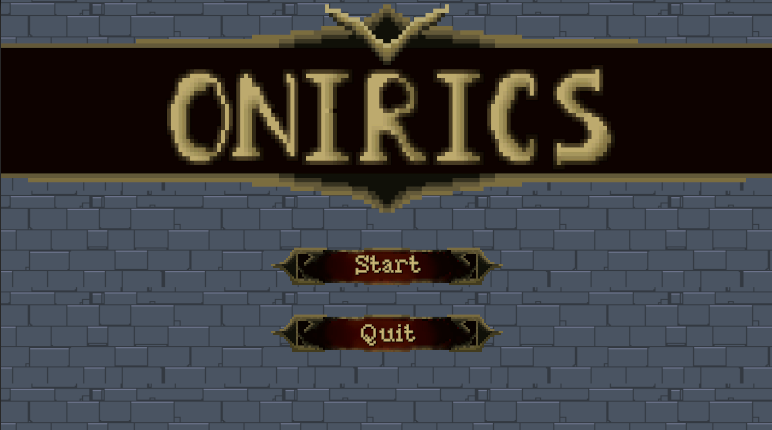
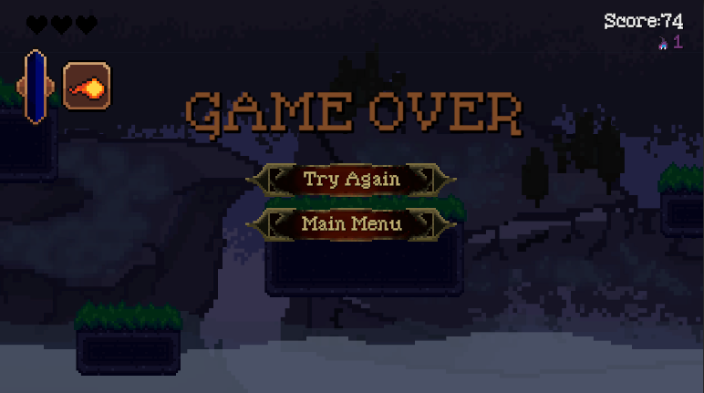
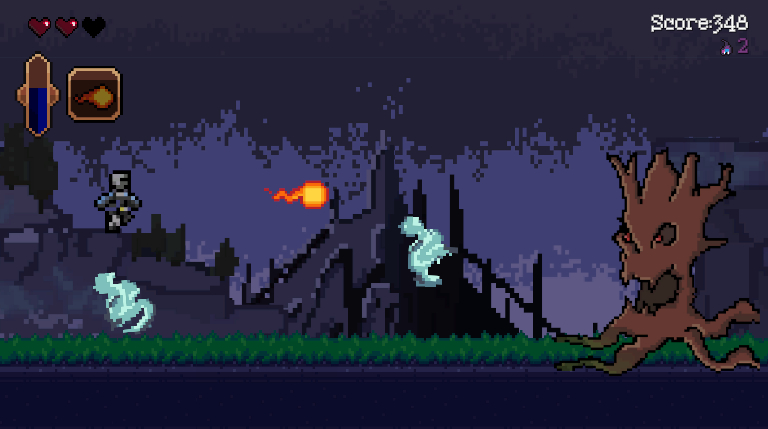
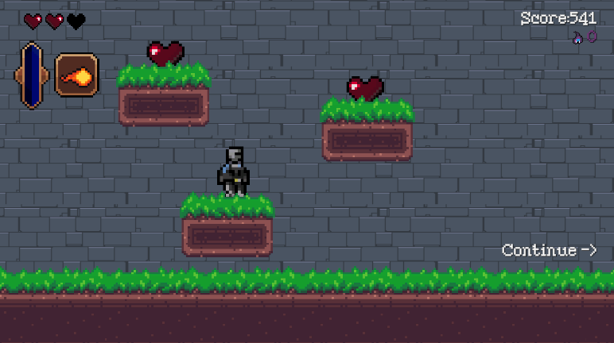
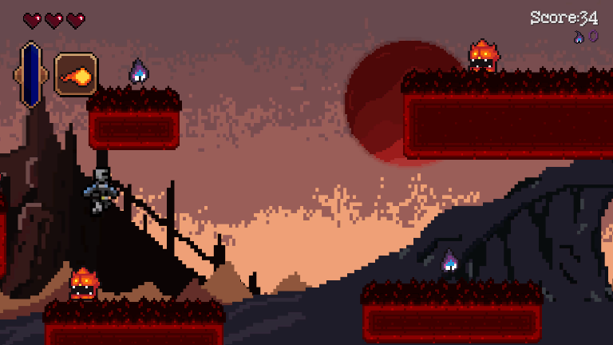

# Proyecto SODVI N1: "Onirics"
## Integrantes:
 - Ortega Novoa Octavio
 - Alberto Nieto Cabrera
 - Nicolás Bravo Vilchis
 - Juan Carlos Torres
 - Jafet Daniel Hernandez Rosas
## Información:
 - Equipo 4
 - Semestre 2025-1
 - Nivel 1
## Descripción:
Onirics es un emocionante videojuego endless runner con toques de plataformas, ambientado en un fascinante mundo de fantasía medieval postapocalíptico. En esta épica aventura, asumirás el papel de un legendario héroe destinado a enfrentarse a los temibles demonios que han sumido al mundo en la oscuridad. Domina el arte del movimiento ágil y despliega ingeniosas estrategias al combinar habilidades únicas para superar desafíos, derrotar enemigos y demostrar tu destreza. Sumérgete en esta historia cargada de acción, donde cada decisión puede marcar la diferencia entre la victoria y la caída. ¡La salvación del mundo está en tus manos!
## Documentación:
[Game Design Document](https://docs.google.com/document/d/1_jeumNhiDDIlDwldw26V9yBszaTCB5tIoWwKTS6C_E4/edit)

[Documentación del código](https://github.com/notsunnyatall/EndlessRunnerProject/blob/main/Assets/Scripts/ScriptingAPI.md)
## Gameplay:

## Ejecutable:
[Link a Google Drive](https://drive.google.com/file/d/16i2FcAUFwLBTEBSk64sGCgyWTqiz0ibq/view?usp=sharing)
## Conclusión:
Este proyecto representó un gran desafío para nuestro equipo, ya que no solo tuvimos que enfrentar retos técnicos y de conocimiento en el desarrollo de videojuegos, sino también superar dificultades relacionadas con la organización y el trabajo en equipo. A lo largo del desarrollo, aprendimos a coordinar nuestras habilidades, dividir tareas de manera eficiente y manejar los tiempos de entrega, lo que nos permitió mejorar significativamente nuestras capacidades de colaboración.

Desde el punto de vista técnico, trabajar en Unity nos brindó una introducción sólida al motor de desarrollo de videojuegos, permitiéndonos explorar desde conceptos básicos hasta características más avanzadas, como la creación de mecánicas, diseño de niveles, optimización y manejo de interacciones. También nos enfrentamos a problemas inesperados, como bugs y ajustes en las funcionalidades, que nos forzaron a investigar, iterar y aplicar soluciones creativas.

Además, esta experiencia nos enseñó la importancia de documentar el progreso, mantener una comunicación constante y adaptarnos rápidamente a los cambios durante el proceso de desarrollo. Como equipo, salimos de este proyecto no solo con un producto funcional, sino también con una base más fuerte para afrontar proyectos futuros con mayor confianza y eficiencia. Este primer acercamiento al mundo del desarrollo de videojuegos en Unity marcó un paso importante en nuestro crecimiento como desarrolladores.
